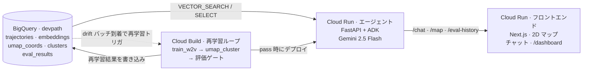

# アーキテクチャ

[English](./ARCHITECTURE.md) &nbsp;|&nbsp; **日本語**

DevPath Navigator の設計ドキュメント。各サブシステムが何をしているか、
なぜその形に落ち着いたか、主要な設計判断の裏にあるトレードオフを記す。
全体像とクイックスタートは [README](./README.ja.md) を参照。

## 1. 概要

DevPath Navigator は会話型のキャリアナビゲーター。エンジニアのキャリア
履歴（role / tech / seniority のステップ列）を受け取り、〜1,500 名の
合成エンジニアと一緒に学習済みベクトル空間に埋め込み、近傍を見つけ、
Gemini が周辺の集合知を根拠付きの推薦に変換する。
「あなたと似た軌跡のエンジニアは次に X に進み、典型的には Y と Z を身に
つけた」というアウトプットになる。

システムは 3 つのサブシステムから構成される:

1. **BigQuery ベースのデータ・埋め込み層** — コーパス、employee 単位の
   埋め込み、2D マップ座標、クラスタメタデータ、再学習評価履歴を保持。
2. **エージェントサービス**（Cloud Run）— Gemini 2.5 Flash + Google
   Agent Development Kit (ADK)、上記 BigQuery 層を扱う 7 ツール。
3. **フロントエンド**（Cloud Run、Next.js）— 2D キャリアマップ、チャット
   面、ツール呼び出しチェーンのリアルタイム可視化、再学習ゲート履歴の
   ダッシュボード。

これに加えて **Cloud Build 再学習パイプライン** がループを閉じる:
BigQuery への新規データ流入 → 再学習 → 評価ゲート → 条件付き Cloud Run
ロールアウト。


ソース ([`docs/architecture.ja.drawio`](./docs/architecture.ja.drawio))
は [diagrams.net](https://app.diagrams.net) で開いて編集できる
（ファイルをダブルクリックすれば draw.io デスクトップアプリでも開く）。
上の SVG にも同じ XML が埋め込まれているので、SVG を直接 draw.io に
ドロップしても編集ソースが復元される。同じ図を、コードと一緒に diff
できる Mermaid 版で:



合成データ生成 (`data-gen/`) と埋め込み学習 (`embedding/`) は、稼働して
いる「サービス」ではなく初回セットアップ用のスクリプトなので、この
ランタイムアーキテクチャ図には含めていない。

## 2. データモデル

### 2.1 Taxonomy

`data-gen/taxonomy.yaml` が role 名 / seniority レベル / tech トークンの
単一ソース。データ生成、エージェントの入力正規化、フロントの dropdown
すべてがこれを参照する。

- **Roles**（12 種）: `backend`, `frontend`, `fullstack`, `mobile`, `sre`,
  `platform`, `data_engineer`, `ml_engineer`, `genai_engineer`,
  `security`, `em`, `pm`
- **Seniority**（5 種）: `junior`, `mid`, `senior`, `staff`, `manager`
- **Tech トークン**（〜50 種）はカテゴリで名前空間分けされる: `lang.*`
  （言語）, `web.*`（Web フレームワーク）, `infra.*`（インフラ）, `data.*`
  （データシステム）, `ml.*`（ML ライブラリ）, `mobile.*`, `security.*`

カテゴリで名前空間を分けることで衝突を防ぎ、曖昧な入力（例「python」）も
`lang.python` に明確に解決できる。

### 2.2 BigQuery スキーマ

```
trajectories
  employee_id  STRING                                       -- 例: E00001
  step         INT64                                        -- 0-indexed の位置
  roles        ARRAY<STRUCT<role STRING, years FLOAT64>>    -- 多重ロール + 年数
  tech_stack   ARRAY<STRING>                                -- taxonomy トークン
  seniority    STRING
  archetype    STRING                                       -- 正解ラベル
  batch_id     STRING                                       -- 投入バッチ
```

`roles` を単一の role 文字列ではなく `(role, years)` の配列にしているのは、
同じポジションで複数のロールを兼任するエンジニア（例: シニアバックエンド
兼テックリード）を表現できるようにするため。per-role の years は埋め込みの
重みに使われる（§3）。

埋め込みパイプラインの出力として 3 つの派生テーブル:

```
embeddings    employee_id, vector ARRAY<FLOAT64>, batch_id
umap_coords   employee_id, x, y, cluster_id, archetype, batch_id
clusters      cluster_id, size, dominant_archetype, archetype_purity,
              centroid_x, centroid_y
```

`embeddings.vector` は BigQuery `VECTOR_SEARCH` の入力で、エージェントの
類似軌跡検索に使われる。

再学習ループの判定を記録する 5 つ目のテーブル:

```
eval_results  run_id, run_at, batches, recall_at_10, n_clusters,
              n_noise, mean_archetype_purity, archetypes_covered,
              vocab_size, held_out_n, decision, decision_reasons, notes
```

### 2.3 合成コーパス

コーパスは `data-gen/generate.py` の固定シードから全て生成される。
実在の人事データは関与しない。

6 種類のキャリアアーキタイプがコーパスの骨格を作る:

| アーキタイプ | おおよその比率 | パターン |
|---|---:|---|
| `backend_to_sre` | 25% | backend → platform tech 込みの backend → SRE / platform |
| `frontend_to_em` | 22% | frontend → fullstack → エンジニアリングマネジメント |
| `data_to_ml` | 22% | データエンジニア → ML エンジニア |
| `mobile_to_backend` | 13% | モバイル専門 → クロスファンクショナルバックエンド |
| `jobhopper` | 18% | 短期ジョブホップ、関連ドメインへの寄りに偏らせる |
| `ml_to_genai` | drift バッチで 100% | ML エンジニア → GenAI エンジニア（再学習デモ用） |

各アーキタイプには構造化されたステージ定義がある — primary role pool、
optional な secondary role pool、tech pool、seniority レンジ、year レンジ。
ステップ単位の生成は制御されたノイズを含めてサンプリングする:

- **多重ロールステップ**（全ステップの 10–15% 程度）: secondary role pool
  が primary の 50% 程度の years でロールインする。
- **横断 detour**（全軌跡の 15%）: 別アーキタイプの pool から取った
  追加ステップを中盤に挿入し、クラスタに現実的な曖昧さを与える。
- **Tech のオーバーラップ**（slot あたり 〜10%）: 一部の tech トークンは
  ステージの primary pool ではなくコーパス全体の pool から抽出される。

ノイズ率は HDBSCAN が「全体としては純度の高いクラスタを多数」「ただし
本当に曖昧なエンジニアからなる noise クラスタも 1 つ」というレイアウトを
出すよう調整してある。1 アーキタイプ = 1 クラスタの完璧な対応に
なってしまうと合成データらしさが見えすぎるため。

### 2.4 合成データ評価の循環性について

意図的に構造を埋め込んだコーパスに対してパイプラインを評価するのは、
表面的には循環している。本作品の立場: これは **「埋め込みパイプラインが
我々が埋め込んだ構造を回収できるかの回帰テスト」** であり、推薦品質が
実データに汎化することを証明するものではない。
評価ハーネス（`eval/run.py`）の構造は、合成 archetype ラベルを実データの
キャリア成果ラベルに差し替えるだけで再利用できるよう設計してある。

## 3. 埋め込みと検索

### 3.1 トークン化

各軌跡を employee あたり 1 つの「sentence」にフラット化して
Word2Vec に渡す。各ステップから出るトークン:

- 各 role を `round(years)` 回（`[1, 10]` にクランプ）
- 各 tech トークンを 1 回ずつ
- seniority トークンを 1 回

role トークンを年数で繰り返すことで、tenure が W2V の context 重みに
反映される: backend を 4 年やったエンジニアは、1 年だけだったエンジニア
より `backend` を強く引っ張る。決定的に重要なのは、推論時に新規
ユーザーを埋め込む際にも同じ展開を使うこと。これで学習と推論が同じ空間に
留まる。

### 3.2 学習

`embedding/train_w2v.py` で skip-gram Word2Vec を学習する: `dim=128`,
`window=5`, `negative=5`, `epochs=60`, `workers=1`。
**`workers=1` は譲れない**: マルチワーカーだと Word2Vec は固定シードでも
非決定的になり、BigQuery に保存したコーパス埋め込みとエージェントが
ランタイムで学習する W2V がずれてしまう。`VECTOR_SEARCH` が間違った
近傍を返すことになる。

### 3.3 軌跡埋め込み

`embedding/trajectory.embed_trajectory(steps, vectors)` が軌跡 → ベクトル
の単一関数。各ステップで year-weighted な `step_tokens` を取り、語彙内の
トークンベクトルを平均し、ステップ間で時間減衰の重み付き平均を取る
（最新ステップが weight 1、過去 `k` ステップは `exp(-0.3 · k)`）。

学習時のコーパス投影（`embeddings` テーブル作成）も、推論時のユーザー
投影（エージェントの各ツール）も、両方この関数を経由する。将来この埋め
込みモデルを RQ-VAE や transformer エンコーダに差し替える場合、変更
すべきはこの関数の中身だけ。

### 3.4 2D 投影とクラスタリング

`embedding/umap_cluster.py` がコーパス埋め込みを UMAP で 2D に投影し
（`n_neighbors=15`, `min_dist=0.1`, `metric="cosine"`,
`random_state=42`）、HDBSCAN でクラスタリングする
（`min_cluster_size=25`, `min_samples=5`）。フロントのキャリアマップは
この 2D レイアウトを SVG レンダリングしたもの。

新規ユーザーは **UMAP `transform()` を直接通さない**。`transform()` は
HDBSCAN のクラスタ境界を保存しないため。代わりに: W2V 空間にユーザーを
埋め込み → `VECTOR_SEARCH` で k=10 近傍を取得 → 近傍の `umap_coords` を
inverse-distance で重み付け平均してユーザー位置とする。
つまり 2D マップは「説明用の表示面」で、本質的な検索は元の埋め込み空間で
行われる。

## 4. エージェント

### 4.1 構成

エージェントは Google Agent Development Kit の上に乗った Vertex AI の
Gemini 2.5 Flash。ルートエージェント 1 つ、サブエージェントなし、ツール
セットは固定。「エージェント性」は Gemini がツール連鎖を選ぶことから
来るもので、マルチエージェントトポロジーから来るものではない。

エージェントは FastAPI サーバー（`agent/server.py`）として Cloud Run で
動く。サーバーの責務:

- **コンテナ起動時のステート初期化**: BigQuery クライアントを開き、
  指定バッチから軌跡をロードし、W2V を in-process で学習し、学習済み
  `KeyedVectors` をプロセス全体のステートとして保持する。1,500 名規模で
  〜3 秒。
- **`/chat`** — マルチターン会話、レート制限、session 継続、応答にツール
  呼び出し/結果の完全トレースを含む。
- **`/map`** — クラスタマップデータ（キャッシュ済み）。
- **`/eval-history`** — 再学習履歴。

### 4.2 ツール

| ツール | 目的 |
|---|---|
| `normalize_profile` | フリーフォームの入力を taxonomy に強制（"Postgres" → `data.postgres`、"K8s" → `infra.kubernetes`）。`corrections` と `unresolved` を返してエージェントが透明に説明できる。 |
| `locate_user` | ユーザー軌跡を埋め込み、`VECTOR_SEARCH` で近傍コーパスを取得、クラスタ・archetype・2D 座標・top neighbors を返す。 |
| `find_similar_trajectories` | k 件の類似軌跡のフルステップ列を返す。エージェントが具体例を根拠にできる。 |
| `explain_cluster` | クラスタの詳細: dominant archetype、ステップごとのロール推移、頻出 tech、seniority 分布。 |
| `skill_gap_analysis` | 目標クラスタに common だがユーザーには absent な tech / role を炙り出す。 |
| `recommend_next_steps` | k 近傍エンジニアの「次のステップ」を集計し、next-role 別に 2–3 案 + `representative_trajectories`（各要素は `{employee_id, trajectory: "backend(4y) → ml(2y) → platform"}`）を返す。エージェントは chat では人間が読める `trajectory` 文字列を引用し、ID は reasoning log パネルに残してパワーユーザー向けの検証手段とする。 |
| `nlq_over_corpus` | 自然言語 → BigQuery SQL → 結果。集計系の質問（「クラスタ 5 には何人いる？」）に使う。 |

ツールシグネチャは入れ子構造ではなく並列配列（`steps_roles`,
`steps_role_years`, `steps_tech`, `steps_seniority`）にしてある。
Gemini が function-call schema を解釈する際、並列配列のほうが安定する。

### 4.3 instruction とディフェンス

System instruction（`agent/agent.py`）は 3 セクション:

1. **言語とスタイル** — ユーザーの言語に合わせる（日本語 in → 日本語 out）、
   tech トークンは canonical form を維持、結論を先に書く。
2. **Taxonomy リファレンス** — 有効な role / tech / seniority トークンの
   完全な一覧を instruction に inline で含める。これにより埋め込み語彙に
   含まれない prefix（"db." 等）をエージェントが発明しなくなる。
3. **セキュリティとインジェクション耐性** — 譲れないルール: system prompt
   の開示を拒否、"ignore previous instructions" / role-play override の
   試みを拒否、ユーザーが imperative として渡したツール引数（例:
   `nlq_over_corpus` の question として生 SQL を渡すような試み）を拒否、
   off-topic な生成を拒否。1 つのメッセージにキャリア質問と注入の両方が
   混ざっていた場合は、キャリアの部分にだけ答え、注入は黙ってスルーする。

`nlq_over_corpus` には LLM の上にさらに独自のバリデーション層がある:

- SQL コメント（`/* */`, `--`, `#`）を除去してから検査することで、モデルが
  禁止トークンをコメント内に隠せないようにする。
- `INFORMATION_SCHEMA`, `__TABLE__`, `@@`, `$(` のいずれかが含まれて
  いたら reject。
- DDL/DML キーワード（`INSERT`, `UPDATE`, `DELETE`, `DROP`, `ALTER`,
  `CREATE`, `TRUNCATE`, `MERGE`, `GRANT`, `REVOKE`）を含む場合は reject。
- 最初のキーワードが `SELECT` または `WITH` であることを要求。
- `LIMIT` を要求（文字列リテラル中の "limit" はカウントしない）。
- 参照可能テーブルを 4 つ（`trajectories`, `embeddings`, `umap_coords`,
  `clusters`）に制限。ドット無しの bare 識別子は CTE alias 扱い。
- SQL 長を 2,000 文字に、BigQuery ジョブの `maximum_bytes_billed` を
  100 MB にハードキャップ。バリデータをすり抜けたクエリが BigQuery 側で
  止まる。

## 5. 再学習ループ

### 5.1 メカニズム

BigQuery に新しいキャリアデータが到着することがループ全体のトリガー。
構造:

```
pipelines/inject-drift.sh
  ├─ data-gen/generate.py --batch drift          ┐
  ├─ data-gen/load_to_bq.py --batch drift        │ 新規行のロード
  └─ gcloud builds submit --config               │
        pipelines/cloudbuild.retrain.yaml        │
        └─ pipelines/retrain.sh                  ┘
              ├─ embedding/train_w2v.py
              ├─ embedding/umap_cluster.py
              ├─ embedding/plot.py
              └─ eval/run.py
                  ├─ Recall@10 + cluster stats を計算
                  ├─ 直近の pass 記録と比較
                  ├─ 判定を eval_results に挿入
                  └─ pass の場合: gcloud run services update agent
```

Cloud Run は次のコールドスタート時に新モデルを読み込む（エージェントは
起動時に BigQuery から W2V を学習するため、新リビジョン = 新モデル。
コンテナを再ビルドする必要はない）。

### 5.2 評価

`eval/run.py` は実行ごとに 2 系統の指標を計算する:

- **Recall@10** — 次ロール予測の精度。stratified で archetype あたり 25
  名を決定的に hold-out。各 hold-out について、最初の n-1 ステップを
  入力として埋め込み、コーパスから 10 近傍（self を除く）を取得し、その
  近傍の n-1 ステップ目のロールが hold-out の実際の次ロールと一致するか
  確認する。Recall@10 は一致した割合。
- **クラスタ統計**: クラスタ数、平均 archetype 純度、出現する archetype の
  集合、語彙サイズ。

### 5.3 ゲート

`eval/gate.py` が直近の pass/baseline 記録と比較し、4 条件全てを満たす
場合に pass:

1. `recall_at_10 ≥ previous − 0.10`。0.10 は textbook 値 0.05 より緩めに
   設定してある: stratified hold-out は新 archetype が増えると増える、
   かつ最も新しい archetype の hold-out は 1-step truncated view から
   予測するのが構造的に最も難しいため。
2. `vocab_size ≥ previous`（語彙は減ってはいけない）。
3. 直近 run に含まれていた archetype が現在の run にも全て存在する。
4. `n_clusters ≥ previous − 1`。UMAP/HDBSCAN のクラスタ数はコーパス
   サイズの揺らぎに敏感で、1 つ減るのは許容、2 つ以上減るのは拒否。

判定とチェック理由は `eval_results` に永続化される。`/dashboard` が
Recall@10 の推移グラフと判定履歴を描画する。fail のときは「なぜ deploy
されなかったか」が表示されるので、運用者はロールバックするか tolerance
を意図的に緩めるかを根拠を持って判断できる。

## 6. フロントエンド

フロントエンド（`frontend/src/app/`）は Next.js 15 App Router の
プロジェクト。ページは 2 つ。

**`/`** がメインのキャリアマップ体験。左ペインは 1,500 点 UMAP 散布図を
inline SVG で描画（チャートライブラリではなく SVG を選んだのは、first-load
JS を 〜110 KB に抑え、"あなたはここ" の脈動アニメーションと推奨経路の
曲線矢印に正確な制御を効かせるため）。右ペインがプロフィールフォーム、
チャット、ツール呼び出し/結果がリアルタイムで流れる推論ログパネル。

プロフィールフォームには 2 つの入力モードがあり、上部タブで切り替え、
選択は `localStorage` に保存される:

- **シンプル**（デフォルト） — textarea 1 個。ユーザーが自然言語で自分の
  キャリアを書く。フロント側で短い前置きを付けて、エージェントに
  `normalize_profile → locate_user → find_similar_trajectories →
  recommend_next_steps` の順で呼ぶよう指示する。デモ向けかつ、
  `agent/agent.py` の system prompt が元から想定していた経路
  （プレイブック冒頭の "When the user describes their career, build a
  best-guess set of those four arrays. Then call `normalize_profile`..."）。
- **詳細** — 構造化ステップフォーム。各ステップに role 兼任・経験年数・
  シニアリティ・taxonomy 拘束の技術スタックピッカーを並べる。LLM の
  NL パースが `unresolved` トークンを残すような状況で、ユーザーが
  taxonomy を厳密に指定したいときに使う。最終的に同じ会話メッセージ形に
  シリアライズされるので、エージェント側のパスは同一。

右カラムはフォームを `max-h-[55vh] overflow-y-auto` で包み、提案ボタンを
`sticky bottom-0` にしてある。ユーザーがステップを何個追加しても、下の
チャット欄が画面外に押し出されない。

**`/dashboard`** は再学習履歴。Recall@10 の時系列折れ線（baseline /
pass / fail で色分け）と、各 run の判定理由が列挙されたテーブル。

フロントエンドは Next.js の API ルート（`/api/map`, `/api/chat`,
`/api/eval-history`）経由でしかエージェントに触らない。ブラウザが直接
エージェントに届くことはなく、CORS・rate limit・`AGENT_ALLOWED_ORIGINS`
は 1 オリジンだけ気にすれば良くなる。

## 7. セキュリティ姿勢

エージェントは公開デモなので `--allow-unauthenticated`、未認証訪問者が
データを抜けず、課金も吹き飛ばせないよう各種ディフェンスを設定してある。

- **レート制限** — エージェントサービスに IP 単位の token bucket（
  `/chat` は 3 burst / 6 req/min、読み取り系は 20 burst / 60 req/min）。
  in-process なので各 Cloud Run インスタンスが独立してカウントする。
- **CORS** — `AGENT_ALLOWED_ORIGINS` でフロントエンドオリジンのみを
  許可。env 未設定時のみワイルドカードに fallback（ローカル開発用）。
- **入力長 cap** — `user_id`/`session_id` ≤ 128 文字、`message` ≤ 4,000
  文字、`nlq_over_corpus(question)` ≤ 1,000 文字。FastAPI が 422 で
  弾くのでツール dispatch にも届かない。
- **NL→SQL ハードニング** — §4.3 参照。
- **プロンプトインジェクション耐性** — §4.3 参照。
- **IAM スコープ** — エージェント SA は `devpath` データセット単位の
  `bigquery.dataViewer`（プロジェクト単位ではない）。今後このプロジェクト
  に別のデータセットが現れても、エージェントには見えない。`bigquery.jobUser`
  はプロジェクト単位（BigQuery がデータセット単位の同等ロールを公開して
  いないため）。
- **非 root コンテナ** — エージェント・フロントエンドとも uid 1000 の
  専用ユーザーで実行。
- **HTTP セキュリティヘッダー** — フロントエンドが Content-Security-Policy
  （`default-src 'self'`, `connect-src 'self'`）、`X-Frame-Options: DENY`、
  `X-Content-Type-Options: nosniff`、`Referrer-Policy:
  strict-origin-when-cross-origin`、最小限の `Permissions-Policy` を返す。
- **エラーサニタイズ** — `/chat` の 500 レスポンスは opaque な incident id
  のみ返し、実例外は同じ id で Cloud Logging に記録。
- **予算アラート** — GCP プロジェクトに月額 3,000 JPY、50%/90%/100% （
  実費）と 120%（予測）でメール通知。
- **CI** — push と pull request のたびに ruff、pytest、フロントエンド
  ビルド、`gitleaks`（履歴を含むシークレットスキャン）。GitHub Actions は
  immutable な commit SHA に pinning。

## 8. 既知の制約と将来課題

- **分散レート制限の回避** — レート制限は IP 単位かつインスタンス単位。
  IP をローテーションする攻撃者は per-IP の envelope を超えられる。
  最終ガードは月額予算アラート。
- **起動時 Word2Vec 学習** — デモには便利だが、モデルが Cloud Run コールド
  スタート時点のコーパスバージョンに暗黙的に紐付く形になる。学習済み
  `KeyedVectors` を GCS に永続化してそこからロードするように変えれば、
  ロールバックが明示的になる。
- **session 永続化** — `InMemoryRunner` は session をプロセス内に持つ。
  `min-instances=0` の idle scale-down で会話が消える。session を
  Firestore に移せばコールドスタートを跨いで継続できる。
- **transformer ベース埋め込み** — W2V + averaging はベースライン。
  RQ-VAE や transformer エンコーダで置き換えるのは `embed_trajectory` の
  実装を差し替えるだけで済む。
- **実データ評価ハーネス** — `eval/run.py` を実データに適用するなら、
  ground truth を合成 archetype ラベルから「ダウンストリームのキャリア
  成果」に差し替える必要がある。それで初めてゲートの recall 指標が
  合成コーパスの外に汎化する。
