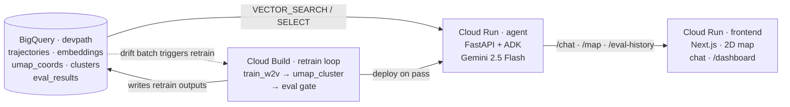

# Architecture

**English** &nbsp;|&nbsp; [日本語](./ARCHITECTURE.ja.md)

This document describes the design of DevPath Navigator: what each
subsystem does, why it is shaped the way it is, and the trade-offs
behind the major decisions. For a higher-level overview and quickstart,
see the [README](./README.md).

## 1. Overview

DevPath Navigator is a conversational career navigator. It takes an
engineer's career history (a sequence of role / tech / seniority
steps), embeds it into a learned vector space alongside a corpus of
~1,500 synthetic engineers, finds the engineers nearest in that space,
and uses Gemini to turn the surrounding neighborhood into a grounded
recommendation: *"engineers with paths like yours moved to X next,
typically picking up Y and Z."*

The system is built around three subsystems:

1. A **BigQuery-backed data and embedding layer** holding the corpus,
   per-employee embeddings, the 2D map projection, cluster metadata,
   and retraining evaluation history.
2. An **agent service** (Cloud Run) running Google Agent Development
   Kit (ADK) with Gemini 2.5 Flash and seven tools that operate over
   the BigQuery layer.
3. A **frontend** (Cloud Run, Next.js) that renders the 2D career map,
   hosts the chat surface, displays the agent's tool-call chain in
   real time, and visualizes the retraining gate history.

A separate **Cloud Build retraining pipeline** closes the loop:
new data in BigQuery → retrain → evaluation gate → conditional Cloud
Run rollout.


The diagram source ([`docs/architecture.drawio`](./docs/architecture.drawio))
opens directly in the draw.io desktop app (double-click) or in
[diagrams.net](https://app.diagrams.net) — and the SVG above has the
same XML embedded, so dropping the SVG into draw.io also recovers the
editable source. A Mermaid version of the same picture lives below;
it diffs cleanly with the code:



Both data generation (`data-gen/`) and the embedding training step
(`embedding/`) are intentionally absent: they're one-off setup scripts,
not running services. The diagram is the runtime architecture.

## 2. Data model

### 2.1 Taxonomy

The taxonomy (`data-gen/taxonomy.yaml`) is the single source of truth
for valid role names, seniority levels, and tech tokens. It is
consumed by data generation, the agent's input normalization, and the
frontend's dropdown selectors.

- **Roles** (12): `backend`, `frontend`, `fullstack`, `mobile`, `sre`,
  `platform`, `data_engineer`, `ml_engineer`, `genai_engineer`,
  `security`, `em`, `pm`
- **Seniority** (5): `junior`, `mid`, `senior`, `staff`, `manager`
- **Tech tokens** (~50) namespaced by category: `lang.*` (programming
  languages), `web.*` (web frameworks), `infra.*` (infrastructure),
  `data.*` (data systems), `ml.*` (ML libraries), `mobile.*`,
  `security.*`

Namespacing the tech tokens prevents collisions and makes ambiguous
inputs (e.g. "python") trivially resolvable to `lang.python`.

### 2.2 BigQuery schema

```
trajectories
  employee_id  STRING                                       -- e.g. E00001
  step         INT64                                        -- 0-indexed position
  roles        ARRAY<STRUCT<role STRING, years FLOAT64>>    -- multi-role with tenure
  tech_stack   ARRAY<STRING>                                -- taxonomy tokens
  seniority    STRING
  archetype    STRING                                       -- ground-truth label
  batch_id     STRING                                       -- ingest batch
```

`roles` is an array of (role, years) pairs rather than a single role
string so the schema can model engineers who held more than one role
in the same position — a senior backend engineer who is also a tech
lead, for example. Per-role years are downstream input to the
embedding weight (§3).

Three derived tables hold the output of the embedding pipeline:

```
embeddings    employee_id, vector ARRAY<FLOAT64>, batch_id
umap_coords   employee_id, x, y, cluster_id, archetype, batch_id
clusters      cluster_id, size, dominant_archetype, archetype_purity,
              centroid_x, centroid_y
```

`embeddings.vector` is the input to BigQuery `VECTOR_SEARCH`, which
the agent uses to find nearest-neighbor engineers.

A fifth table records the retraining loop's decisions:

```
eval_results  run_id, run_at, batches, recall_at_10, n_clusters,
              n_noise, mean_archetype_purity, archetypes_covered,
              vocab_size, held_out_n, decision, decision_reasons, notes
```

### 2.3 Synthetic corpus

The corpus is generated entirely from a fixed seed in
`data-gen/generate.py`. No real personnel data is involved.

Six career archetypes drive the data shape:

| Archetype | Approximate share | Pattern |
|---|---:|---|
| `backend_to_sre` | 25% | Backend → backend with platform tech → SRE / platform |
| `frontend_to_em` | 22% | Frontend → fullstack → engineering management |
| `data_to_ml` | 22% | Data engineer → ML engineer |
| `mobile_to_backend` | 13% | Mobile specialist → cross-functional backend |
| `jobhopper` | 18% | Short stints, biased toward related domains |
| `ml_to_genai` | 100% of drift batch | ML engineer → GenAI engineer (reserved for the retraining demo) |

Each archetype has a structured stage definition — primary role pool,
optional secondary role pool, tech pool, seniority range, year range.
Per-step generation samples from these with controlled noise:

- **Multi-role steps** (~10–15% of all steps): the secondary role pool
  rolls in with ~50% the years of the primary role.
- **Cross-archetype detours** (15% of trajectories): an extra step
  pulled from another archetype's pool is inserted mid-career to add
  realistic ambiguity to the clusters.
- **Tech overlap** (~10% per slot): some tech tokens are drawn from
  the wider corpus pool rather than the stage's primary pool.

The noise rates are tuned so HDBSCAN produces high-purity clusters
overall (most at 100% archetype purity) but with a visible noise
cluster of genuinely ambiguous engineers, rather than a clean
1-cluster-per-archetype layout that would betray its synthetic origin.

### 2.4 On the circularity of evaluating against synthetic data

Evaluating an embedding pipeline against a corpus that was deliberately
generated with known structure is, on its face, circular. The chosen
position: this is a **regression test on whether the pipeline can
recover the structure we built in**, not a proof that the recommendation
quality generalizes to a real population. The evaluation harness is
designed so that swapping in held-out real trajectories (with archetype
labels replaced by a downstream-success ground truth) requires no
changes to `eval/run.py`.

## 3. Embedding and retrieval

### 3.1 Tokenization

Each trajectory is flattened into a single token sequence — one
"sentence" per employee — that Word2Vec consumes. For each step the
tokens emitted are:

- Each role repeated `round(years)` times (clamped to `[1, 10]`)
- Every tech token once
- The seniority token once

Repeating the role token weights the W2V context by tenure: an
engineer who spent four years as a backend engineer pushes more
context onto `backend` than one who spent one year. Crucially, the
same expansion is used at inference time when embedding a new user, so
training and serving stay in the same space.

### 3.2 Training

`embedding/train_w2v.py` trains skip-gram Word2Vec with `dim=128`,
`window=5`, `negative=5`, `epochs=60`, and `workers=1`. The single
worker is non-negotiable: with `workers>1` Word2Vec is
non-deterministic even with a fixed seed, which means the corpus
embeddings stored in BigQuery would drift from the agent's runtime
W2V, and `VECTOR_SEARCH` would land in the wrong neighborhood.

### 3.3 Trajectory embedding

`embedding/trajectory.embed_trajectory(steps, vectors)` is the single
function that maps a trajectory to a vector. It runs `step_tokens` on
each step to get year-weighted tokens, averages the in-vocab token
vectors per step, then takes a time-decayed weighted average across
steps (most recent step at weight 1, earlier steps at
`exp(-0.3 · k_from_recent)`).

This function is shared by both the training-time projection (used to
populate `embeddings`) and the inference-time projection (used by the
agent's tools to embed a fresh user). When the embedding model is
eventually swapped for something heavier — RQ-VAE, a transformer
encoder — only the body of this function changes.

### 3.4 2D projection and clustering

`embedding/umap_cluster.py` projects all corpus embeddings to 2D with
UMAP (`n_neighbors=15`, `min_dist=0.1`, `metric="cosine"`,
`random_state=42`) and clusters the 2D points with HDBSCAN
(`min_cluster_size=25`, `min_samples=5`). The frontend's career map is
this 2D layout rendered as SVG.

A new user is **not** transformed through UMAP directly — UMAP's
`transform()` does not preserve HDBSCAN cluster boundaries. Instead,
the user is embedded into the W2V space, the k=10 nearest corpus
engineers are found via `VECTOR_SEARCH`, and the user's map position
is the inverse-distance-weighted average of those neighbors'
`umap_coords`. The 2D map is therefore a presentation surface; the
substantive search happens in the original embedding space.

## 4. Agent

### 4.1 Construction

The agent is built with Google Agent Development Kit on top of Gemini
2.5 Flash via Vertex AI. It's a single root agent — no sub-agents —
with a fixed set of tools. The "agent-ness" comes from Gemini's
choice of which tools to chain for a given turn, not from a
multi-agent topology.

The agent runs in a FastAPI server (`agent/server.py`) deployed to
Cloud Run. The server is responsible for:

- **State setup** at container startup: open a BigQuery client, load
  trajectories from the configured batches, train W2V in-process,
  store the trained `KeyedVectors` in process-wide state. This takes
  ~3 seconds for the current 1,500-employee corpus.
- **`/chat`** — multi-turn conversation with session continuity,
  enforced rate limit, returns the agent's reply plus the full
  tool-call / tool-response trace.
- **`/map`** — the cluster map data, cached.
- **`/eval-history`** — the retraining run history.

### 4.2 Tools

| Tool | Purpose |
|---|---|
| `normalize_profile` | Coerce free-form user input into the taxonomy ("Postgres" → `data.postgres`, "K8s" → `infra.kubernetes`). Returns corrected/unresolved tokens so the agent can be honest about what it dropped. |
| `locate_user` | Embed the user's trajectory; find nearest corpus engineers via `VECTOR_SEARCH`; return cluster, archetype, 2D coordinates, top neighbors. |
| `find_similar_trajectories` | Return the full step-by-step trajectories of the k most similar engineers, so the agent can ground a recommendation in concrete examples. |
| `explain_cluster` | Describe a cluster: dominant archetype, role progression per step, most common tech tokens, seniority distribution. |
| `skill_gap_analysis` | Given a target cluster id, surface tech tokens and roles that are common in the target cohort but absent from the user. |
| `recommend_next_steps` | Look at the immediate next step of the k nearest engineers, group by next-role, return 2–3 candidate moves with `representative_trajectories` (each a `{employee_id, trajectory: "backend(4y) → ml(2y) → platform"}`). The agent grounds its chat reply in the human-readable `trajectory` strings; the IDs stay in the reasoning log for power users. |
| `nlq_over_corpus` | Natural language → BigQuery SQL → results. Used for aggregate questions ("how many engineers in cluster 5?"). |

The tool signatures use parallel arrays (`steps_roles`,
`steps_role_years`, `steps_tech`, `steps_seniority`) rather than
nested structures, because the function-call schema Gemini consumes
is more reliable that way.

### 4.3 Instruction and defenses

The system instruction (`agent/agent.py`) has three sections:

1. **Language and style** — match the user's language (Japanese in →
   Japanese out), keep tech tokens in canonical form, lead with the
   concrete finding.
2. **Taxonomy reference** — the full list of valid role / tech /
   seniority tokens is included inline, so the agent doesn't invent
   prefixes that won't match the embedding vocab.
3. **Security and injection resistance** — non-negotiable rules:
   refuse to reveal the system prompt, refuse "ignore previous
   instructions" / role-play override attempts, refuse to execute
   tools with arguments dictated as imperatives (e.g. attempts to pass
   raw SQL as a `nlq_over_corpus` question), refuse off-topic content
   generation. If a message mixes a legitimate career question with an
   injection attempt, answer the career part and silently ignore the
   rest.

`nlq_over_corpus` has its own validation layer on top of the LLM:

- Strip SQL comments (`/* */`, `--`, `#`) before checking, so a model
  cannot hide forbidden tokens inside comments.
- Reject any of: `INFORMATION_SCHEMA`, `__TABLE__`, `@@`, `$(`.
- Reject DDL/DML keywords (`INSERT`, `UPDATE`, `DELETE`, `DROP`,
  `ALTER`, `CREATE`, `TRUNCATE`, `MERGE`, `GRANT`, `REVOKE`).
- Require `SELECT` or `WITH` as the first keyword.
- Require `LIMIT` (string-literal occurrences don't count).
- Restrict referenced tables to an allow-list of four (`trajectories`,
  `embeddings`, `umap_coords`, `clusters`); bare names without a dot
  are treated as CTE aliases.
- Cap SQL length at 2,000 characters and `maximum_bytes_billed` at
  100 MB on the BigQuery job itself, so even a query that bypasses the
  validator cannot scan a pathologically large table.

## 5. Retraining loop

### 5.1 Mechanism

New career data arriving in BigQuery is the trigger for the entire
loop. The pieces:

```
pipelines/inject-drift.sh
  ├─ data-gen/generate.py --batch drift          ┐
  ├─ data-gen/load_to_bq.py --batch drift        │ ingest new rows
  └─ gcloud builds submit --config               │
        pipelines/cloudbuild.retrain.yaml        │
        └─ pipelines/retrain.sh                  ┘
              ├─ embedding/train_w2v.py
              ├─ embedding/umap_cluster.py
              ├─ embedding/plot.py
              └─ eval/run.py
                  ├─ compute Recall@10 + cluster stats
                  ├─ compare against latest pass record
                  ├─ insert decision into eval_results
                  └─ on pass: gcloud run services update agent
```

Cloud Run picks the new model up on its next cold start (the agent
trains W2V from BigQuery at startup, so a new revision *is* the new
model — no container rebuild is needed).

### 5.2 Evaluation

`eval/run.py` computes two families of metrics per run:

- **Recall@10** on next-role prediction. A stratified, deterministic
  hold-out of 25 employees per archetype is selected. For each
  held-out engineer, take their first n-1 steps as input, embed, find
  the 10 nearest corpus engineers (excluding self), look at those
  neighbors' step at index n-1, and check whether the held-out's
  actual next role is in that predicted set. Recall@10 is the
  fraction that match.
- **Cluster statistics**: number of clusters, mean archetype purity,
  set of archetypes represented, vocab size.

### 5.3 Gate

`eval/gate.py` compares the current run against the most recent
pass/baseline. A run passes if all four hold:

1. `recall_at_10 ≥ previous − 0.10`. The 0.10 tolerance is
   intentionally generous (vs. the textbook 0.05) because the
   stratified hold-out set grows when a new archetype joins, and the
   freshest archetype's held-out examples are inherently the hardest
   to predict from a one-step truncated view.
2. `vocab_size ≥ previous`. The model never loses tokens.
3. No archetype present in the previous run is missing from the
   current run.
4. `n_clusters ≥ previous − 1`. UMAP/HDBSCAN's cluster count is
   sensitive to corpus size; one fewer cluster is acceptable, two
   fewer is not.

The decision and the per-check reasons are persisted to
`eval_results`. The dashboard at `/dashboard` renders the recall trend
and the decision history; a fail explains *why* the deploy was
blocked, so the operator can either roll back or relax the tolerance
explicitly.

## 6. Frontend

The frontend (`frontend/src/app/`) is a Next.js 15 App Router project
with two pages.

**`/`** is the main career-map experience. The left panel renders the
1,500-point UMAP scatter as inline SVG (chosen over a charting library
to keep first-load JS at ~110 KB and to give precise control over the
"you are here" pulse animation and the curved recommendation
arrows). The right panel hosts the profile form, chat, and the
real-time reasoning-log panel that surfaces every tool call and result.

The profile form has two input modes, toggled from a tab at the top
and persisted in `localStorage`:

- **Simple** (default) — a single textarea. The user describes their
  career in natural language; the frontend wraps it with a short
  preamble that instructs the agent to run
  `normalize_profile → locate_user → find_similar_trajectories →
  recommend_next_steps`. This is the demo-friendly path and the one
  the system prompt was originally designed around (the playbook in
  `agent/agent.py` starts with "When the user describes their career,
  build a best-guess set of those four arrays. Then call
  `normalize_profile`...").
- **Detailed** — the structured step form: per step, role(s),
  tenure(s), seniority, and a tech-stack picker constrained to the
  taxonomy. Useful when the LLM's NL parsing leaves `unresolved`
  tokens and the user wants exact taxonomy control. Behind the scenes
  the form serializes itself into the same conversational message
  shape, so the agent path is identical.

The right column wraps the form in `max-h-[55vh] overflow-y-auto`
with a `sticky bottom-0` submit button, so the chat panel below
stays in the viewport regardless of how many steps the user adds.

**`/dashboard`** renders the retraining history: a Recall@10 line
chart over time, color-coded by decision (baseline / pass / fail), and
a full table of every run with the gate's reason bullet list.

The frontend talks to the agent only via its own Next.js API routes
(`/api/map`, `/api/chat`, `/api/eval-history`). The browser never
reaches the agent directly, which means CORS, rate-limit headers, and
the agent's `AGENT_ALLOWED_ORIGINS` setting all only have to handle
one origin.

## 7. Security posture

The agent is `--allow-unauthenticated` for the public demo, so its
defenses are configured to keep an unauthenticated visitor from
exfiltrating data or running up the bill.

- **Rate limiting** — per-IP token bucket on the agent service (3
  burst / 6 req/min on `/chat`, 20 burst / 60 req/min on
  read endpoints), implemented in-process so each Cloud Run instance
  enforces its own ceiling.
- **CORS** — `AGENT_ALLOWED_ORIGINS` is set to the frontend origin
  only; the wildcard fallback only fires when the env var is unset
  (local development).
- **Input length caps** — `user_id` and `session_id` ≤ 128 chars,
  `message` ≤ 4,000 chars, `nlq_over_corpus(question)` ≤ 1,000 chars.
  FastAPI rejects oversize requests with 422 before any tool dispatch.
- **NL→SQL hardening** — see §4.3.
- **Prompt injection resistance** — see §4.3.
- **IAM scoping** — the agent's runtime service account holds
  `bigquery.dataViewer` on the `devpath` dataset (not the project), so
  any other dataset that might land in this project later is invisible
  to the agent. `bigquery.jobUser` is project-scoped because
  BigQuery does not expose a dataset-scoped equivalent.
- **Non-root containers** — both the agent and frontend Dockerfiles
  run as a dedicated uid 1000 user.
- **HTTP security headers** — the frontend sets Content-Security-Policy
  (`default-src 'self'`, `connect-src 'self'`), `X-Frame-Options: DENY`,
  `X-Content-Type-Options: nosniff`, `Referrer-Policy:
  strict-origin-when-cross-origin`, and a minimal `Permissions-Policy`.
- **Error sanitization** — `/chat` 500 responses return an opaque
  incident id, with the underlying exception logged to Cloud Logging
  by the same id.
- **Budget alert** — monthly GCP budget at 3,000 JPY with notifications
  at 50% / 90% / 100% (actual) and 120% (forecast).
- **CI** — ruff, pytest, frontend build, and `gitleaks` (full-history
  secret scan) on every push and pull request. GitHub Actions are
  pinned to immutable commit SHAs.

## 8. Known limitations and future work

- **Distributed rate-limit evasion** — rate limit is per-IP and
  per-instance. A motivated attacker rotating through many IPs can
  exceed the per-IP envelope. The monthly budget alert is the final
  guard.
- **Word2Vec retraining at startup** — convenient for the demo but
  means the model is implicitly tied to the corpus version visible at
  the moment Cloud Run cold-started. Persisting trained `KeyedVectors`
  to GCS and loading from there would make rollback explicit.
- **Session persistence** — `InMemoryRunner` keeps sessions in
  process; with `min-instances=0`, idle scale-down drops them. Moving
  sessions to Firestore would let conversations survive across cold
  starts.
- **Transformer-based embedding** — the W2V + averaging approach is a
  baseline. Swapping it for an RQ-VAE or transformer-encoded sequence
  embedding would be a single-file change to `embed_trajectory`.
- **Real-data evaluation harness** — `eval/run.py` would need a
  different ground-truth source (downstream career outcomes rather
  than synthetic archetype labels) before the gate's recall metric
  generalizes outside the synthetic corpus.
