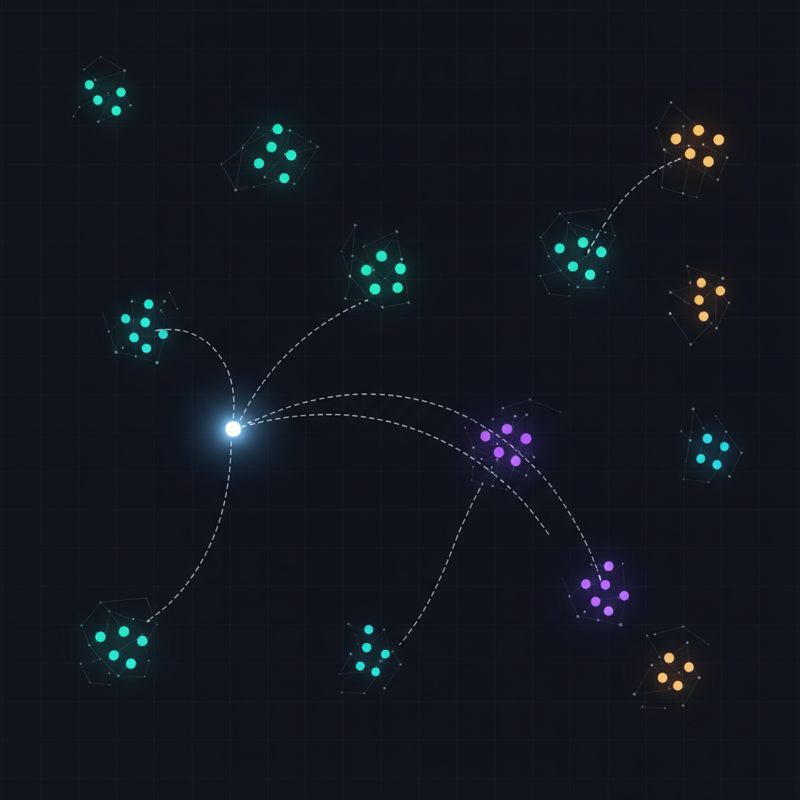
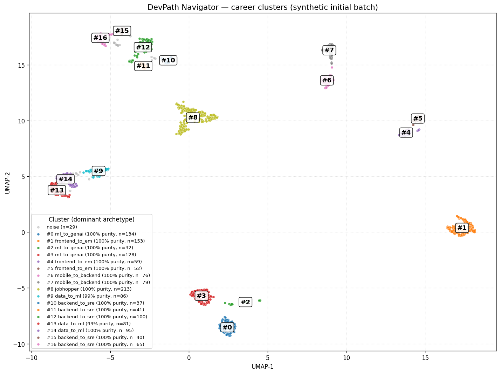

# DevPath Navigator

**English** &nbsp;|&nbsp; [日本語](./README.ja.md)



Vectorize software engineers' career trajectories, project them onto a 2D
map, and let a Gemini-powered agent recommend "what to do next" grounded
in the actual moves of engineers with similar paths.

[**▶ Live demo**](https://devpath-frontend-430189693163.asia-northeast1.run.app)
&middot; [Agent API (Swagger)](https://devpath-agent-430189693163.asia-northeast1.run.app/docs)
&middot; [Architecture](./ARCHITECTURE.md)



## Why

Most engineers decide their next role from anecdotes — a senior friend's
experience (n=1), or a recruiter's pitch. The information that *should*
drive the decision — what hundreds of engineers with similar histories
actually did next — is locked inside HR systems and scattered career
pages, never structured for retrieval.

DevPath Navigator treats career history as a sequence of role / tech /
seniority tokens, learns embeddings over a synthetic corpus, and lets
you query the resulting map conversationally. You describe your career,
the agent locates you on the map, finds engineers with similar
trajectories, and tells you what they did next — grounded in the
actual role-and-tech paths those engineers walked (e.g. "12 engineers
who went backend(4y) → ml(2y) → platform"). The raw employee IDs
remain available in the reasoning-log panel for power users who want
to inspect specific examples.

## Features

- **Conversational career agent** — Gemini 2.5 Flash + Google Agent
  Development Kit, with seven tools that chain together for multi-step
  reasoning (profile normalization → location → similar trajectories →
  gap analysis → next-step recommendation). The agent picks the chain
  per question; the frontend visualizes it live in a reasoning-log
  panel.
- **Two profile-input modes** — *Simple* (default) accepts a free-text
  description like "5 years of backend in Java/Postgres, then 2 years
  ML with PyTorch — want to head toward SRE" and lets
  `normalize_profile` coerce it into the taxonomy. *Detailed* exposes
  the structured step form (role + tenure + tech stack per step) for
  power users who want exact taxonomy control. The agent backend is
  identical for both — the simple textarea just lets the LLM do the
  intake parsing.
- **Interactive 2D career map** — pure-SVG UMAP/HDBSCAN scatter of the
  whole corpus, with the user's position pulsing in real time and
  recommended next steps drawn as curved arrows toward the cohort
  centroid.
- **Self-updating model** — when new career data arrives in BigQuery, a
  Cloud Build pipeline retrains the embedding, runs an evaluation gate
  (Recall@10 + archetype coverage), and ships a new agent revision only
  if the gate passes. The dashboard at `/dashboard` shows the full run
  history.
- **Reproducible synthetic corpus** — `data-gen/` produces ~1,500
  realistic trajectories (multi-role steps, per-role years, controlled
  cross-archetype noise) deterministically from a fixed seed. No real
  personnel data is used or required.
- **Production-shape deployment** — Cloud Run for both services,
  Terraform for infrastructure, GitHub Actions CI with secret scanning,
  rate-limited and CORS-locked public endpoints, dataset-scoped IAM,
  monthly budget alerts.

## Stack

| Layer | Technology |
|---|---|
| Agent | FastAPI · Google Agent Development Kit · Gemini 2.5 Flash on Vertex AI |
| Frontend | Next.js 15 (App Router) · React 19 · TypeScript · Tailwind CSS · SVG |
| Embedding | Word2Vec (gensim) · UMAP · HDBSCAN |
| Data | BigQuery (`VECTOR_SEARCH`) · synthetic corpus |
| Retrain | Cloud Build · Cloud Run revision rollout · BigQuery `eval_results` |
| Hosting | Cloud Run (agent + frontend) · Terraform-managed |

### Vertex AI / Gemini wiring

The agent's LLM calls go through **Vertex AI** (the hackathon's
required runtime), not AI Studio. Concrete bindings:

- **Model** — `gemini-2.5-flash` invoked via the `google-genai` SDK
  with `vertexai=True`. Overridable via `GEMINI_MODEL` env var
  ([`agent/agent.py:12`](./agent/agent.py)).
- **Client routing** — `GOOGLE_GENAI_USE_VERTEXAI=true` is set at
  process start ([`agent/server.py:38`](./agent/server.py)) and is
  also injected into the Cloud Run revision through Terraform
  ([`infra/cloudrun.tf:74`](./infra/cloudrun.tf)).
- **Region** — `VERTEX_LOCATION` (default `us-central1`).
- **IAM** — the agent runtime SA has `roles/aiplatform.user`
  ([`infra/iam.tf:18`](./infra/iam.tf)), and `aiplatform.googleapis.com`
  is in the Terraform-managed API list
  ([`infra/services.tf:9`](./infra/services.tf)).

Trajectory embeddings are NOT computed via Vertex AI. The corpus is
small enough (~1,500 trajectories) that a custom 128-d Word2Vec model
trained in ~3 s is faster, deterministic (with `workers=1`), and
free — so embedding lives in `embedding/` on the local toolchain and
its output is stored in BigQuery.

## Architecture


The diagram source is [`docs/architecture.drawio`](./docs/architecture.drawio)
— double-click it to open in the draw.io desktop app, or upload to
[diagrams.net](https://app.diagrams.net). The SVG above has the same
XML embedded, so dropping it into draw.io also recovers the editable
source. See [ARCHITECTURE.md](./ARCHITECTURE.md) for the design
decisions behind each subsystem.

## Quickstart

### Prerequisites

- macOS or Linux
- Python 3.12+ (managed by `uv`)
- Node.js 22+
- `gcloud` CLI authenticated to the project below

```bash
gcloud auth login
gcloud auth application-default login
gcloud config set project ai-agent-hackathon-499013

uv sync
```

### Generate the corpus and train the model

```bash
# Synthetic corpus → BigQuery
uv run python data-gen/generate.py   --batch initial
uv run python data-gen/load_to_bq.py --batch initial --recreate-table
uv run python data-gen/generate.py   --batch drift
uv run python data-gen/load_to_bq.py --batch drift

# Embeddings + clusters
uv run python embedding/train_w2v.py    --batches initial drift
uv run python embedding/umap_cluster.py --batches initial drift
uv run python embedding/plot.py
```

### Run the agent and the frontend locally

```bash
# Terminal 1 — agent on :8088 (~3s startup: trains W2V from BigQuery)
AGENT_BATCHES=initial,drift uv run uvicorn agent.server:app \
  --host 127.0.0.1 --port 8088

# Terminal 2 — frontend on :3000
cd frontend && npm install
AGENT_URL=http://127.0.0.1:8088 npm run dev
```

Then open `http://127.0.0.1:3000`.

### Try the agent from the command line

Local:

```bash
curl -sS http://127.0.0.1:8088/chat \
  -H 'content-type: application/json' \
  -d '{
    "user_id": "alice",
    "message": "I'\''ve been a backend engineer for 5 years (Java, Postgres, then Go on Kubernetes). I want to move into SRE — what'\''s the gap?"
  }' | jq .
```

Hit the live agent directly (rate-limited but unauthenticated):

```bash
# readiness probe
curl -sS https://devpath-agent-430189693163.asia-northeast1.run.app/health
# → {"status":"ok"}

# real chat (rate limited to 5 burst / 0.25 rps per IP)
curl -sS https://devpath-agent-430189693163.asia-northeast1.run.app/chat \
  -H 'content-type: application/json' \
  -d '{
    "user_id": "demo",
    "message": "backend を 5 年（Java/Postgres、後半 Go と Kubernetes）。SRE に進むなら何が足りませんか？"
  }' | jq .
```

The full set of available endpoints is at
[`/docs`](https://devpath-agent-430189693163.asia-northeast1.run.app/docs)
(FastAPI Swagger UI).

## Demo scenario — the retraining loop

The headline story of the project. Two state transitions to show:

1. **Baseline:** train on the initial corpus only. The corpus has no
   `genai_engineer` transitions. Ask the agent "I'm an ML engineer,
   what's next?" — it suggests data-engineering paths.
2. **Drift:** inject 300 employees whose paths move from `ml_engineer`
   into `genai_engineer`. Cloud Build retrains, the evaluation gate
   checks the new model didn't regress, the agent is automatically
   rolled forward. Ask the same question — now `genai_engineer` is one
   of the recommended next steps, grounded in trajectories from the
   drift cohort (e.g. "ml_engineer(2y) → genai_engineer").

```bash
# 1) Record the baseline (synthetic corpus, initial batch only)
uv run python eval/run.py --batches initial --notes baseline

# 2) Inject the drift batch — automatically triggers the Cloud Build
#    retrain pipeline. Gate decides whether to ship the new model.
pipelines/inject-drift.sh
```

The history of every retrain attempt, with the gate's decision and the
reasons it gave, is at
[`/dashboard`](https://devpath-frontend-430189693163.asia-northeast1.run.app/dashboard)
and in BigQuery:

```sql
SELECT run_at, batches, recall_at_10, n_clusters, archetypes_covered, decision
FROM `ai-agent-hackathon-499013.devpath.eval_results`
ORDER BY run_at DESC;
```

## Synthetic data, by design

This repository ships *only* synthetic data. No real employee,
candidate, or third-party personnel information is included. The
corpus is generated by `data-gen/generate.py` from a fixed seed, so
anyone cloning the repo reproduces the same 1,500 trajectories — the
generator itself is the canonical record.

The corpus has structure: six career archetypes with realistic
multi-role steps (e.g. "backend for 4 years, simultaneously tech lead
for 1.5 years"), per-role tenure that the embedding weighs more
heavily, and a controlled rate of cross-archetype detours so the
clusters look noisy in the way real career data does.

## Documentation

- [ARCHITECTURE.md](./ARCHITECTURE.md) — system, data model, embedding,
  agent, retraining loop, evaluation, security
- [infra/README.md](./infra/README.md) — Terraform for the GCP
  environment (APIs, IAM, BigQuery dataset, Cloud Run services)

## License

Apache License 2.0. See [LICENSE](./LICENSE).
