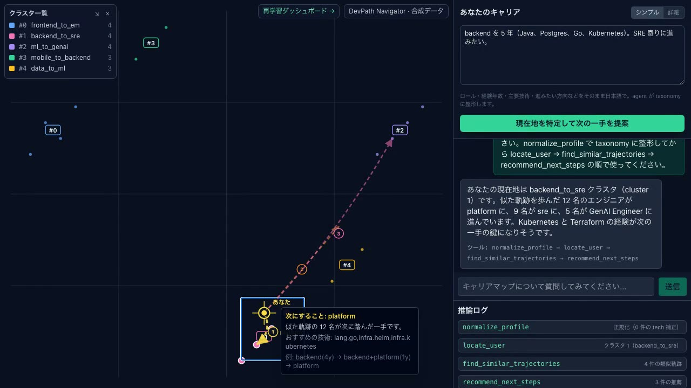

# DevPath Navigator

**English** &nbsp;|&nbsp; [日本語](./README.ja.md)

Vectorize software engineers' career trajectories, project them onto a
2D map, and let a Gemini agent recommend "what to do next" — grounded
in the actual moves of engineers with similar paths.

[**▶ Live demo**](https://devpath-frontend-430189693163.asia-northeast1.run.app)
&middot; [Agent API (Swagger)](https://devpath-agent-430189693163.asia-northeast1.run.app/docs)
&middot; [Architecture](./ARCHITECTURE.md)

## 30-second tour

[](./docs/demo-30s.mp4)

> GitHub strips inline `<video>` tags from README files; click the
> thumbnail to play the MP4. The 90-second submission walk-through
> (covers the retrain dashboard) is at
> [`docs/demo-90s.mp4`](./docs/demo-90s.mp4).

## Why

Most engineers decide their next role from anecdotes — a senior
friend's experience (n=1), or a recruiter's pitch. The information
that *should* drive the decision — what hundreds of engineers with
similar histories actually did next — is locked inside HR systems and
scattered career pages, never structured for retrieval.

DevPath Navigator treats career history as a sequence of
role / tech / seniority tokens, learns embeddings over a synthetic
corpus, and lets you query the resulting map conversationally. The
agent locates you, finds engineers with similar trajectories, and
tells you what they did next — grounded in actual role-and-tech paths
(e.g. "12 engineers who went backend(4y) → ml(2y) → platform").

## Features

- **Conversational agent** — Gemini 2.5 Flash + Google ADK with seven
  chained tools (profile normalization → locate → find similar →
  gap analysis → recommend next); the frontend logs each tool call live.
- **Two input modes** — *Simple* free-text textarea or *Detailed*
  structured step form. Same backend; simple just lets the LLM do the
  intake parsing.
- **Interactive 2D map** — pure-SVG UMAP / HDBSCAN scatter; user
  position pulses; recommendation arrows curve toward cohort centroids.
- **Self-updating model** — new data triggers a Cloud Build retrain;
  an eval gate (Recall@10 + per-archetype min) blocks regressions; full
  history at `/dashboard`.
- **Production-shape** — Cloud Run + Terraform + rate-limited public
  endpoints + dataset-scoped IAM + monthly budget cap.

## Stack

| Layer | Technology |
|---|---|
| Agent | FastAPI · Google Agent Development Kit · Gemini 2.5 Flash on Vertex AI |
| Frontend | Next.js 15 · React 19 · TypeScript · Tailwind CSS |
| Embedding | Word2Vec (gensim) · UMAP · HDBSCAN |
| Data | BigQuery (`VECTOR_SEARCH`) · synthetic corpus |
| Retrain | Cloud Build · Cloud Run revisions · `eval_results` |
| Hosting | Cloud Run · Terraform-managed |

**Vertex AI wiring** — `gemini-2.5-flash` via `google-genai` SDK with
`vertexai=True` ([`agent/agent.py`](./agent/agent.py),
[`agent/server.py:38`](./agent/server.py),
[`infra/cloudrun.tf`](./infra/cloudrun.tf)); SA has
`roles/aiplatform.user` ([`infra/iam.tf`](./infra/iam.tf)). Embedding
itself is Word2Vec — local, deterministic (with `workers=1`), and
faster than a hosted embedding for the 1,500-trajectory corpus.

## Architecture


Editable source:
[`docs/architecture.drawio`](./docs/architecture.drawio). Design
decisions per subsystem are in [ARCHITECTURE.md](./ARCHITECTURE.md).

## Quickstart

### Prerequisites

- macOS or Linux, Python 3.12+ (managed by `uv`), Node.js 22+
- `gcloud` CLI authenticated to your GCP project

```bash
gcloud auth login
gcloud auth application-default login
gcloud config set project <your-project-id>
uv sync
```

### Build the corpus and train the model

```bash
uv run python data-gen/generate.py   --batch initial
uv run python data-gen/load_to_bq.py --batch initial --recreate-table
uv run python data-gen/generate.py   --batch drift
uv run python data-gen/load_to_bq.py --batch drift

uv run python embedding/train_w2v.py    --batches initial drift
uv run python embedding/umap_cluster.py --batches initial drift
```

### Run locally

```bash
# Terminal 1 — agent on :8088 (~3s startup; trains W2V from BigQuery)
AGENT_BATCHES=initial,drift uv run uvicorn agent.server:app \
  --host 127.0.0.1 --port 8088

# Terminal 2 — frontend on :3000
cd frontend && npm install
AGENT_URL=http://127.0.0.1:8088 npm run dev
```

### Talk to the live agent

```bash
curl -sS https://devpath-agent-430189693163.asia-northeast1.run.app/health
# → {"status":"ok"}

# Rate-limited (5 burst / 0.25 rps per IP)
curl -sS https://devpath-agent-430189693163.asia-northeast1.run.app/chat \
  -H 'content-type: application/json' \
  -d '{"user_id":"demo","message":"backend を 5 年。SRE に進むなら何が足りませんか？"}' | jq .
```

Full endpoint list at
[`/docs`](https://devpath-agent-430189693163.asia-northeast1.run.app/docs).

## Demo scenario — the retrain loop

1. **Baseline:** train on the initial corpus only. Asking "I'm an ML
   engineer, what's next?" returns data-engineering paths — the
   corpus has no `genai_engineer` transitions yet.
2. **Drift:** inject 300 employees moving `ml_engineer →
   genai_engineer`. Cloud Build retrains, the gate checks
   for regressions, the agent rolls forward only if it passes. Same
   question now returns `genai_engineer`, grounded in actual
   drift-cohort trajectories.

```bash
uv run python eval/run.py --batches initial --notes baseline
pipelines/inject-drift.sh   # → Cloud Build → gate → deploy if pass
```

Every retrain attempt, with the gate's decision and reason text, is at
[`/dashboard`](https://devpath-frontend-430189693163.asia-northeast1.run.app/dashboard).

## Synthetic data, by design

Only synthetic data is in this repository — no real personnel info.
`data-gen/generate.py` reproduces the same 1,500 trajectories from a
fixed seed; the generator itself is the canonical record. Six
archetypes, multi-role steps with per-role tenure, controlled
cross-archetype detours for cluster realism.

## Documentation

- [ARCHITECTURE.md](./ARCHITECTURE.md) — design and rationale
- [infra/README.md](./infra/README.md) — Terraform setup
- [CONTRIBUTING.md](./CONTRIBUTING.md) — branch / commit / review rules
- [scripts/demo/README.md](./scripts/demo/README.md) — how the demo
  videos are rendered

## License

Apache License 2.0. See [LICENSE](./LICENSE).
